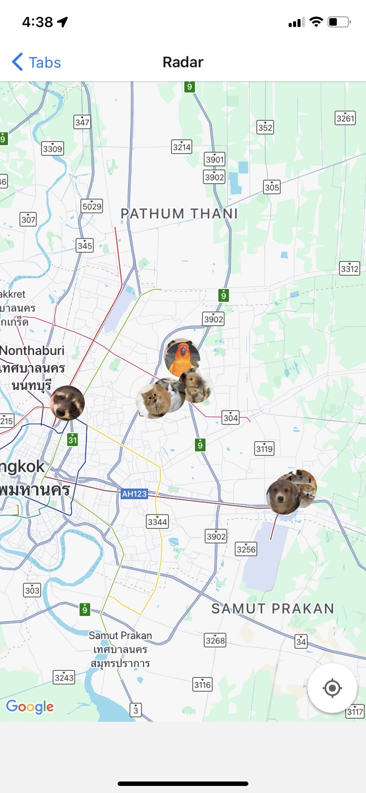

# FindPetProject

---

## 📖 Description
**FindPetProject** เป็นแอป React Native (Expo) ที่ช่วยผู้ใช้งานค้นหาและแจ้งเตือนสัตว์เลี้ยงหายแบบ real-time  
ผู้ใช้สามารถลงประกาศสัตว์หาย ดูสัตว์ใกล้ตัว และติดต่อเจ้าของสัตว์ผ่านระบบแชท

---

## 🎬 Demo / Screenshot
| Home Screen | Alert Screen | Chat Screen |
|------------|--------------|------------|
|  |  |  |

---

## ✨ Features
- ลงประกาศสัตว์หาย พร้อมรูปและรายละเอียด
- ดูสัตว์ใกล้คุณแบบ real-time
- ระบบแชทสำหรับติดต่อผู้พบสัตว์กับเจ้าของ
- จัดการโปรไฟล์ผู้ใช้และแก้ไขข้อมูลส่วนตัว

---

## 🛠 Tech Stack
| Layer | Technology |
|-------|------------|
| Frontend | React Native (Expo) |
| Realtime & Chat | Stream Chat |
| Backend & Database | Supabase |

---

